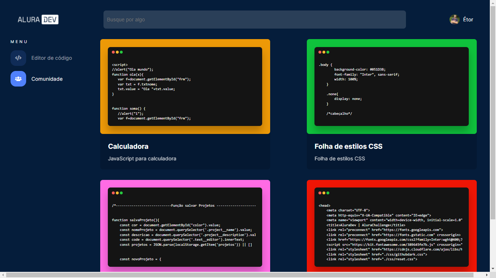

Projeto desenvolvido em atepa do AluraChallenge - FrontEnd 2.

Linguagens utilizadas até o momento:

- HTML
- CSS
- JavaScript

Próximos passos:
- Implementação de edição de código salvo (página comunidade.html)
- Arrumar documentação do projeto
- Colocar aplicação no ar

Aprendizados durante a elaboração do projeto até agora:

- Utilização do Figma para direcionamento do projeto
- Estilo e posicionamento CSS
- Estrutura de funções JS
- Função JS para troca de propriedades de elemento HTML/ estilo CSS
- Implementação de salvamento de formulário e posterior listagem dos dados salvos com localstorage

Screenshots do projeto:

